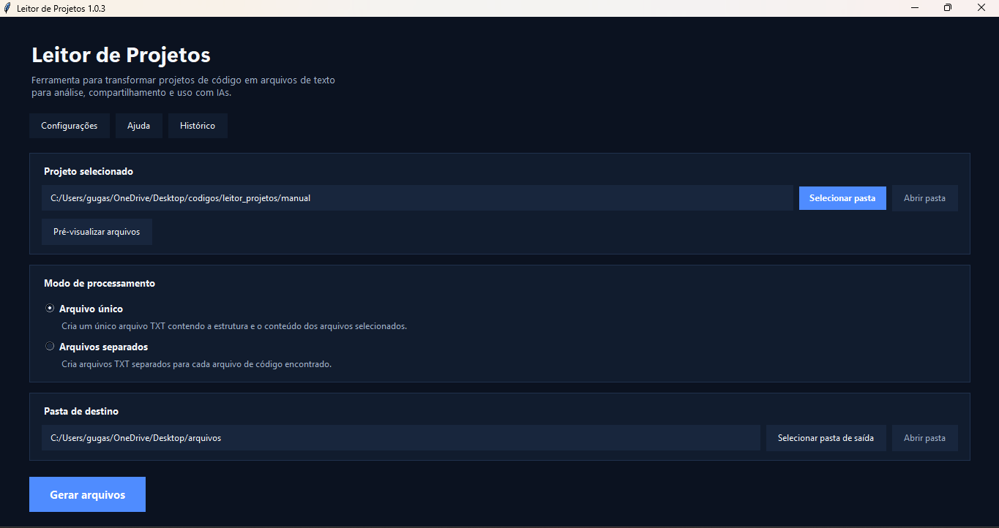
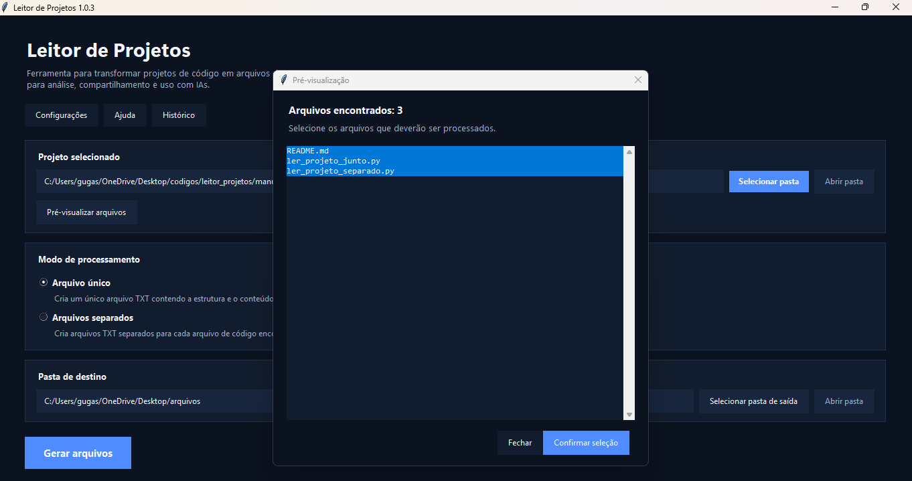

# Project Reader / Leitor de Projetos

A desktop tool for transforming source-code projects into organized text files for **analysis, documentation, sharing and use with AI tools**.

[English](#english) · [Português](#português)

---

## Demo

<!--
Edit this README through GitHub and drag the compressed MP4 below.
GitHub will generate a github.com/user-attachments/... link.
Leave the generated link alone on its own line.
-->

---

## Preview

<table>
  <tr>
    <td align="center" width="50%">
      <strong>Main Interface</strong><br><br>
      
    </td>
    <td align="center" width="50%">
      <strong>File Preview & Selection</strong><br><br>
      
    </td>
  </tr>
</table>

---

# English

## About

**Project Reader** is a desktop tool built to simplify the process of preparing source-code projects for analysis.

Instead of manually opening, copying and organizing multiple files, the application scans a selected project and transforms its contents into one or more structured text files.

This is especially useful when working with:

- AI tools
- Code reviews
- Documentation
- Project analysis
- Debugging
- Refactoring
- Sharing project context

---

## Why?

A programming project may contain dozens or hundreds of files.

When you need to analyze the project as a whole, manually sending files one by one can be slow and inconvenient.

Project Reader simplifies this workflow:

```text
Source-code project
        ↓
   Project Reader
        ↓
Filter and select files
        ↓
Generate organized text
        ↓
AI / Documentation / Review
```

---

## Features

### Project Selection

Choose any source-code project folder directly from the graphical interface.

The application scans the project while respecting the configured filters.

---

### File Preview

Before processing a project, the **Preview** window displays the files found.

You can:

- Review detected files
- Select which files should be processed
- Remove unwanted files from the operation
- Confirm the final selection before generating output

This makes it possible to control exactly what project content is included.

---

## Processing Modes

Project Reader supports two output modes.

### Single File

Combines the selected project structure and file contents into a single text file.

```text
Project
├── index.html
├── style.css
└── script.js

          ↓

project.txt
```

This mode is especially useful when the entire project needs to be sent or analyzed as one context.

### Separate Files

Creates individual text files for the source files found in the project.

```text
index.html
style.css
script.js

       ↓

index.txt
style.txt
script.txt
```

This is useful when you want to inspect or share files separately.

---

## Configuration

The application includes a graphical **Settings** area.

It can be used to configure:

- File extensions to process
- File extensions to ignore
- Folders to ignore
- Specific files to ignore
- Processing preferences

These settings allow the scanner to skip unnecessary content such as build files, dependencies, caches or other files that are not relevant to the analysis.

---

## Saved Preferences

Application preferences are stored locally.

Depending on the current configuration, the program can remember information such as:

- Last project folder
- Processing mode
- Window configuration
- Filtering preferences

This avoids having to configure the application again every time it is opened.

---

## History

The graphical interface also includes a **History** area for accessing information related to previous operations.

This helps make repeated use of the application easier when working with multiple projects.

---

## Using Project Reader with AI

One of the main use cases of Project Reader is preparing programming projects for AI analysis.

Instead of manually copying each file:

```text
Project
   ↓
Project Reader
   ↓
Organized TXT
   ↓
AI Tool
   ↓
Analysis
```

The generated content can be useful for:

- Explaining a codebase
- Finding bugs
- Reviewing code
- Suggesting improvements
- Refactoring
- Creating documentation
- Understanding project architecture
- Providing project context to an AI

---

## Security Notice

Generated text files may contain everything present in the selected project.

Before sharing them with another person or service, review the generated content.

A project may contain sensitive information such as:

```text
Passwords
API keys
Access tokens
Credentials
Private keys
Personal information
Environment configuration
Database connection data
```

Project Reader does not determine whether project content is safe to share.

The user should always review the generated files before sending them elsewhere.

---

## Downloading the Executable

A compiled Windows version is available through the repository's **Releases** page.

Download the latest:

```text
LeitorDeProjetos-1.0.3.exe
```

Then run it normally.

No Python installation is required for users who only want to use the executable.

> [!NOTE]
> Windows may display a warning about an unknown publisher because the executable is not digitally signed.

---

## Running from Source

### Requirements

- Python 3

Clone or download the repository.

Then run:

```bash
python LeitorDeProjetos/main.py
```

The application itself is designed to rely primarily on the Python standard library.

---

## Building the Executable

To create the Windows executable, install PyInstaller:

```bash
pip install pyinstaller
```

Then run:

```bash
pyinstaller --onefile --windowed --name LeitorDeProjetos-1.0.3 LeitorDeProjetos/main.py
```

The generated file will be available in:

```text
dist/
```

---

## Automated Releases

The repository includes a **GitHub Actions** workflow.

When a release tag is created and pushed, the workflow can build the Windows executable and publish it through GitHub Releases.

Example:

```bash
git tag v1.0.3
git push origin v1.0.3
```

This keeps the distributed executable tied to a specific version of the source code.

---

## Manual Version

The repository also contains a:

```text
manual/
```

directory.

This contains scripts related to the original/manual method of processing projects.

It can be useful for:

- Understanding the basic processing logic
- Running the process without the graphical application
- Studying a simpler implementation
- Manually controlling the output

---

## Technologies

Project Reader uses:

- Python
- Tkinter
- File system APIs
- JSON configuration
- PyInstaller
- GitHub Actions

The graphical application does not require a web browser or backend server.

---

## Project Structure

```text
Leitor-de-projetos/
├── .github/
│   └── workflows/
│       └── Build and release automation
│
├── assets/
│   └── screenshots/
│       ├── main-interface.png
│       └── file-preview.png
│
├── LeitorDeProjetos/
│   ├── configuracao/
│   ├── interface/
│   ├── processadores/
│   ├── utils/
│   ├── main.py
│   └── requirements.txt
│
├── manual/
│   └── Manual processing scripts
│
├── .gitignore
├── LICENSE
└── README.md
```

---

## Current Status

The application already provides the complete main workflow:

```text
Select project
      ↓
Scan files
      ↓
Preview selection
      ↓
Choose processing mode
      ↓
Choose destination
      ↓
Generate text files
```

The current distributed version is:

```text
1.0.3
```

Future updates can focus on improving filters, interface usability and project-processing options.

---

# Português

## Sobre

O **Leitor de Projetos** é uma ferramenta desktop criada para simplificar a preparação de projetos de código-fonte para análise.

Em vez de abrir, copiar e organizar vários arquivos manualmente, a aplicação percorre um projeto selecionado e transforma seu conteúdo em um ou mais arquivos de texto organizados.

Isso é especialmente útil para:

- Ferramentas de IA
- Revisão de código
- Documentação
- Análise de projetos
- Depuração
- Refatoração
- Compartilhamento de contexto

---

## Por que usar?

Um projeto de programação pode possuir dezenas ou centenas de arquivos.

Quando é necessário analisar o projeto como um todo, enviar cada arquivo individualmente pode ser lento e inconveniente.

O Leitor de Projetos simplifica esse processo:

```text
Projeto de código
       ↓
Leitor de Projetos
       ↓
Filtrar e selecionar arquivos
       ↓
Gerar texto organizado
       ↓
IA / Documentação / Revisão
```

---

## Funcionalidades

### Seleção de Projeto

Qualquer pasta contendo um projeto de código pode ser selecionada diretamente pela interface gráfica.

A aplicação percorre o projeto respeitando os filtros configurados.

---

### Pré-visualização de Arquivos

Antes do processamento, a janela de **Pré-visualização** exibe os arquivos encontrados.

É possível:

- Conferir os arquivos detectados
- Escolher quais serão processados
- Remover arquivos desnecessários
- Confirmar a seleção antes da geração

Isso permite controlar exatamente quais informações do projeto serão incluídas.

---

## Modos de Processamento

O Leitor de Projetos possui dois modos de saída.

### Arquivo Único

Reúne a estrutura e o conteúdo dos arquivos selecionados em um único arquivo de texto.

```text
Projeto
├── index.html
├── style.css
└── script.js

          ↓

projeto.txt
```

Esse modo é especialmente útil quando todo o projeto precisa ser enviado ou analisado como um único contexto.

### Arquivos Separados

Cria arquivos de texto individuais para os arquivos de código encontrados.

```text
index.html
style.css
script.js

       ↓

index.txt
style.txt
script.txt
```

Esse modo é útil quando os arquivos precisam ser analisados ou compartilhados separadamente.

---

## Configurações

A aplicação possui uma área gráfica de **Configurações**.

Ela pode ser utilizada para controlar:

- Extensões que devem ser processadas
- Extensões que devem ser ignoradas
- Pastas ignoradas
- Arquivos específicos ignorados
- Preferências de processamento

Esses filtros permitem evitar conteúdo desnecessário, como dependências, arquivos temporários, caches, builds e outros elementos que não são importantes para a análise.

---

## Preferências Salvas

As preferências da aplicação são armazenadas localmente.

Dependendo da configuração atual, o programa pode lembrar informações como:

- Última pasta utilizada
- Modo de processamento
- Configuração da janela
- Preferências de filtragem

Isso evita configurar novamente a aplicação a cada execução.

---

## Histórico

A interface também possui uma área de **Histórico** relacionada às operações realizadas anteriormente.

Isso facilita o uso recorrente da ferramenta ao trabalhar com diferentes projetos.

---

## Uso com Inteligência Artificial

Um dos principais objetivos do Leitor de Projetos é preparar projetos de programação para análise por ferramentas de IA.

Em vez de copiar arquivo por arquivo:

```text
Projeto
   ↓
Leitor de Projetos
   ↓
TXT organizado
   ↓
Ferramenta de IA
   ↓
Análise
```

O conteúdo gerado pode ser utilizado para:

- Explicar uma base de código
- Encontrar problemas
- Revisar código
- Sugerir melhorias
- Refatorar
- Criar documentação
- Entender a arquitetura de um projeto
- Fornecer contexto completo para uma IA

---

## Aviso de Segurança

Os arquivos de texto gerados podem conter tudo que estiver presente no projeto selecionado.

Antes de compartilhar o resultado com outra pessoa ou serviço, revise o conteúdo.

Um projeto pode conter informações sensíveis como:

```text
Senhas
Chaves de API
Tokens
Credenciais
Chaves privadas
Informações pessoais
Configurações de ambiente
Dados de conexão com bancos
```

O Leitor de Projetos não determina automaticamente se um conteúdo é seguro para compartilhamento.

A revisão do arquivo gerado é responsabilidade do usuário.

---

## Baixando o Executável

Uma versão compilada para Windows está disponível na área de **Releases** do repositório.

Baixe a versão mais recente:

```text
LeitorDeProjetos-1.0.3.exe
```

Depois execute normalmente.

Quem utiliza o `.exe` não precisa instalar Python.

> [!NOTE]
> O Windows pode mostrar um aviso de editor desconhecido porque o executável não possui assinatura digital.

---

## Executando pelo Código-Fonte

### Requisitos

- Python 3

Baixe ou clone o repositório.

Depois execute:

```bash
python LeitorDeProjetos/main.py
```

A aplicação foi desenvolvida para depender principalmente da biblioteca padrão do Python.

---

## Gerando o Executável

Para criar o executável do Windows, instale o PyInstaller:

```bash
pip install pyinstaller
```

Depois execute:

```bash
pyinstaller --onefile --windowed --name LeitorDeProjetos-1.0.3 LeitorDeProjetos/main.py
```

O arquivo será gerado em:

```text
dist/
```

---

## Releases Automatizadas

O repositório possui um workflow do **GitHub Actions**.

Ao criar e enviar uma tag de versão, o workflow pode gerar o executável do Windows e publicá-lo através do GitHub Releases.

Exemplo:

```bash
git tag v1.0.3
git push origin v1.0.3
```

Isso mantém o executável distribuído associado a uma versão específica do código-fonte.

---

## Versão Manual

O repositório também possui a pasta:

```text
manual/
```

Ela contém scripts relacionados ao método original/manual de processamento dos projetos.

Essa versão pode ser útil para:

- Entender a lógica básica do processamento
- Executar o processo sem a interface gráfica
- Estudar uma implementação mais simples
- Controlar manualmente a geração dos arquivos

---

## Tecnologias

O Leitor de Projetos utiliza:

- Python
- Tkinter
- APIs do sistema de arquivos
- Configurações em JSON
- PyInstaller
- GitHub Actions

A aplicação gráfica não depende de navegador ou servidor backend.

---

## Estrutura do Projeto

```text
Leitor-de-projetos/
├── .github/
│   └── workflows/
│       └── Automação de build e releases
│
├── assets/
│   └── screenshots/
│       ├── main-interface.png
│       └── file-preview.png
│
├── LeitorDeProjetos/
│   ├── configuracao/
│   ├── interface/
│   ├── processadores/
│   ├── utils/
│   ├── main.py
│   └── requirements.txt
│
├── manual/
│   └── Scripts de processamento manual
│
├── .gitignore
├── LICENSE
└── README.md
```

---

## Estado Atual

A aplicação já cobre o fluxo principal completo:

```text
Selecionar projeto
       ↓
Percorrer arquivos
       ↓
Pré-visualizar seleção
       ↓
Escolher modo
       ↓
Escolher destino
       ↓
Gerar arquivos de texto
```

A versão atualmente distribuída é:

```text
1.0.3
```

Atualizações futuras podem focar em novos filtros, melhorias de interface e mais opções de processamento.

---

## License / Licença

This project is available under the **MIT License**.

Este projeto está disponível sob a **Licença MIT**.

See / Consulte `LICENSE`.